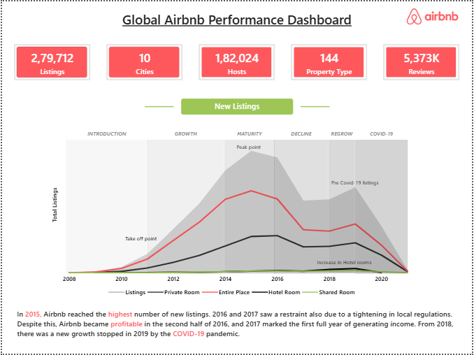
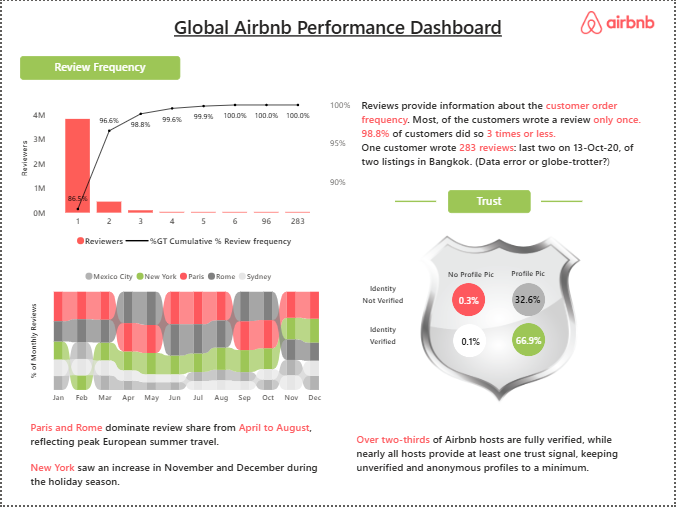

# 🏡 Global Airbnb Performance Dashboard | Power BI

An interactive Power BI dashboard analyzing Airbnb listings, hosts, reviews, ratings, pricing, and customer behavior across major cities using the Maven Analytics Airbnb dataset.

## 📊 Dashboard Preview

### Overview

### Ratings

### Detailed Ratings

### Reviews

---

## 📂 Dataset

The dataset used in this project is provided by **Maven Analytics**.

🔗 DOWNLOAD DATASET FROM HERE - https://mavenanalytics.io/data-playground/airbnb-listings-reviews

> **Note:** The dataset (~243 MB) exceeds GitHub's recommended file size, so it has not been included in this repository. Please download it directly from Maven Analytics using the link above.

---

## 🎯 Project Objective

This dashboard provides insights into Airbnb's global performance by analyzing:

- Listing growth over time
- Market share across cities
- Customer ratings
- Review frequency
- Host verification
- Property pricing
- Seasonal review trends

---

## 🛠 Tools & Technologies

- Power BI
- Power Query
- DAX
- Data Modeling
- Data Visualization

---

## 📈 Key Features

- KPI Cards
- Dynamic Line & Column Charts
- Heatmaps
- Cumulative Percentage Analysis
- Seasonal Trend Analysis
- Host Trust Analysis
- Interactive Dashboard Navigation

---

## 📚 DAX Concepts Used

- CALCULATE()
- FILTER()
- ALL()
- REMOVEFILTERS()
- DISTINCTCOUNT()
- DIVIDE()
- Variables (VAR)
- Calculated Columns
- Cumulative Measures

---

## 💡 Key Insights

- Airbnb experienced rapid growth until 2016 before stabilizing.
- Paris, New York, and Sydney account for nearly half of all listings.
- Most customers leave only one review.
- More than two-thirds of hosts are identity verified.
- Entire homes have the highest average listing prices.

---

## 👩‍💻 Author

**Sakshi Prakash**

📌 LinkedIn: https://www.linkedin.com/in/YOUR-LINKEDIN

📌 GitHub: https://github.com/YOUR-USERNAME
